# endoscopy-polyps-segmentation
## Intro
Colorectal cancer is one of the leading causes of cancer-related deaths worldwide, and early detection of polyps through colonoscopy plays a crucial role in prevention. However, manual polyp identification and segmentation during endoscopic procedures can be time-consuming, subjective, and prone to human error. Automated segmentation methods powered by deep learning can provide accurate, real-time support to clinicians by highlighting polyps and improving diagnostic reliability.

This project focuses on building a deep learning model for polyp segmentation using publicly available colonoscopy image datasets. We perform extensive exploratory data analysis (EDA) and hypothesis testing to understand dataset characteristics, apply preprocessing and augmentation strategies to standardize and enrich the data, and train a ResUNet model with a ResNet34 encoder to segment polyps at the pixel level. The goal is to create a robust system that generalizes across multiple datasets and imaging conditions, supporting the development of computer-aided diagnostic tools for clinical practice.
## Dataset
Our project focuses on polyp segmentation in colonoscopy images, a critical task in computer-aided diagnosis for colorectal cancer prevention. The data used consists of colonoscopy frames paired with pixel-level binary masks that highlight the presence of polyps. Each image serves as an input for the model, while the corresponding mask provides the ground truth for supervised training. The segmentation masks are annotated by medical experts, ensuring high-quality labels that reflect clinically relevant regions.

The primary dataset is Kvasir-SEG, a publicly available medical image dataset released by Simula Research Laboratory. It contains 1,000 high-resolution colonoscopy images and their corresponding polyp masks. In addition to Kvasir-SEG, we integrate two more datasets commonly used in polyp segmentation research: CVC-ClinicDB, which provides 612 images and masks collected from colonoscopy videos, and the Merged Polyp Segmentation Dataset (MPSD), which aggregates multiple polyp datasets into a single, larger resource. Combining these datasets provides a richer variety of polyp appearances, shapes, and lighting conditions, making the model more robust and generalizable.

```txt
Kvasir -> 1000 images, 1000 masks
CVC -> 612 images, 612 masks
MPSD -> 22330 images, 22330 masks
```

All datasets are open-access and widely used benchmarks in medical imaging research. Kvasir-SEG and CVC-ClinicDB can be obtained from their official sources or Kaggle repositories, while MPSD is available as a pre-merged dataset. By leveraging multiple datasets, our project benefits from increased data diversity and volume, helping the model learn better representations of polyps across different patients, endoscopy equipment, and recording conditions.

## EDA
In order to better understand the characteristics of the datasets, we conducted extensive exploratory data analysis (EDA). This included examining image dimensions, aspect ratios, and mask coverage distributions to identify variability across datasets. We visualized pixel intensity histograms for each color channel to study brightness and contrast, and overlaid masks on sample images to qualitatively inspect annotation quality. Scatter plots and histograms were used to explore relationships such as width vs. height, aspect ratio vs. coverage, and brightness vs. contrast. By analyzing both image properties and mask statistics, EDA provided valuable insights into dataset diversity, potential biases, and preprocessing requirements before model training.
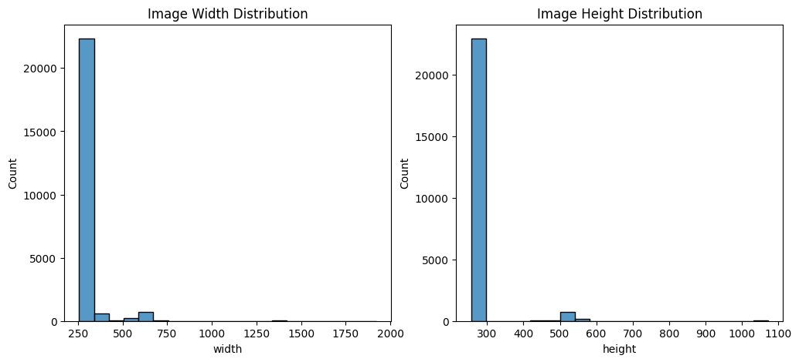
The `Image Width Distribution` plot shows a histogram of image widths in the dataset, revealing that the majority of images have a width of approximately 250 pixels, with a sharp drop-off in frequency for wider images. Only a small number of images exceed 500 pixels in width, indicating a strong concentration around a narrow range of dimensions.
The `Image Height Distribution` plot displays a comparable pattern, with most images having a height of about 300 pixels and very few exceeding 500 pixels. This suggests that the dataset contains predominantly small, uniformly sized images, likely from a standardized imaging protocol such as medical scans or histopathology slides. The consistency in dimensions simplifies preprocessing tasks like resizing or cropping for downstream analysis, but may also indicate limitations in data diversity or resolution.

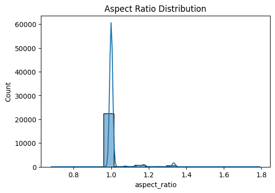
This histogram illustrates the distribution of image aspect ratios (width divided by height) across the dataset. The plot shows a sharp, prominent peak centered around an aspect ratio of 1.0, indicating that the majority of images are nearly square in shape. This suggests a high degree of uniformity in image dimensions, likely due to standardized acquisition protocols commonly used in medical imaging, such as histopathology slides or radiographic scans. A few images exhibit slightly higher aspect ratios (e.g., ~1.2–1.4), but their counts are minimal, implying they are outliers or exceptions rather than a common variation.

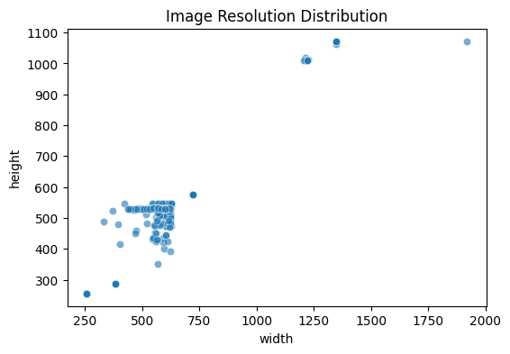
The "Image Resolution Distribution" scatter plot visualizes the relationship between image width and height across the dataset, revealing a clear clustering of images around a central region with widths between 400 and 700 pixels and heights between 400 and 600 pixels. This dense cluster suggests a dominant standard resolution used in the imaging process, likely reflecting a common protocol for medical image capture such as digital pathology or radiology scans. A few outliers exist at higher resolutions—particularly one image approaching 1900 pixels in width and over 1000 pixels in height—indicating either rare high-resolution acquisitions or potential data anomalies. The overall distribution shows that most images are relatively small and consistent in size, which is advantageous for efficient processing and model training.

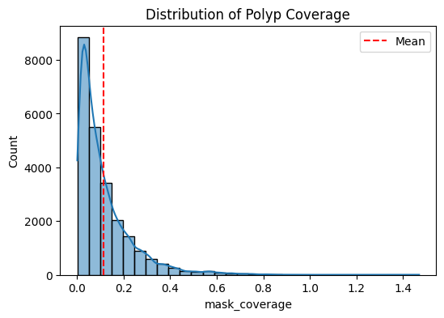
The distribution is heavily skewed toward low values, with a sharp peak near 0.0, indicating that the majority of images contain very little or no polyp coverage. This suggests that most images in the dataset are either negative (no polyps) or have only small polyps occupying a minor portion of the frame. A red dashed line marks the mean coverage, which appears to be slightly above 0.1, reflecting the overall low prevalence of large polyps. The rapid decline in frequency as coverage increases highlights the rarity of images with extensive polyp presence. This pattern is clinically relevant, as it may reflect the natural distribution of polyps in endoscopic imaging—where many examinations yield normal findings or small lesions.
```txt
Empty masks: 460 (1.92%)
Non-empty masks: 23482 (98.08%)
```

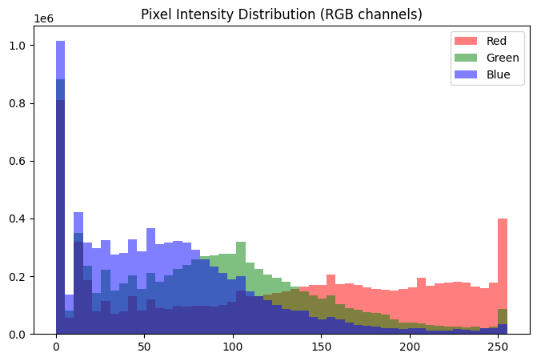
The blue channel exhibits a prominent peak near zero intensity, indicating a high prevalence of dark or low-blue pixels, which may reflect the background or tissue regions with minimal blue coloration—common in medical imaging such as colonoscopy or histopathology slides. The green channel shows a moderate spread with a secondary rise around mid-range intensities, suggesting some presence of green hues, possibly due to tissue staining or lighting conditions. The red channel has a relatively flat distribution with a slight increase toward higher intensities, particularly near 255, indicating that many pixels have strong red components, potentially corresponding to blood vessels, inflamed areas, or specific tissue features. Overall, the distributions reveal that the images are dominated by low-intensity values, especially in blue, with increasing contributions from red at higher intensities. This pattern is typical in medical images where certain tissues or stains absorb or reflect light unevenly

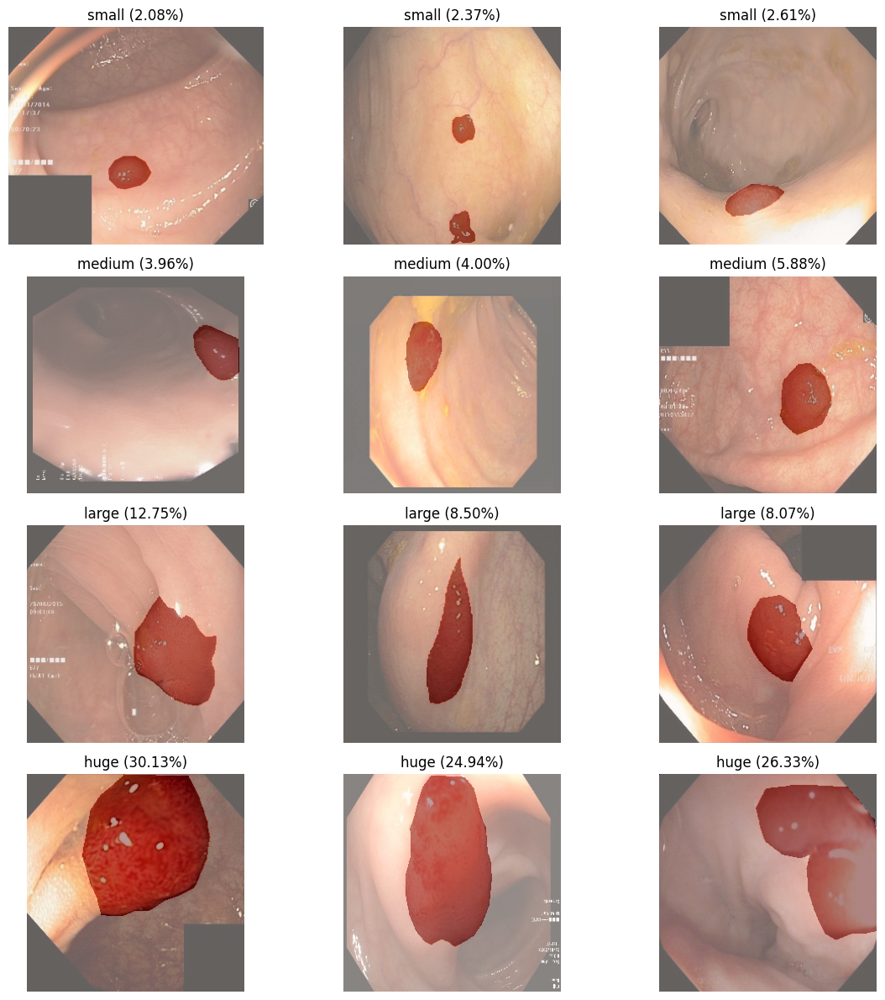
The distribution reveals a clear trend: huge polyps are the most common, collectively accounting for over 80% of cases (30.13%, 24.94%, and 26.33%), indicating that larger lesions dominate the dataset. In contrast, small polyps are relatively rare, with frequencies below 3%, suggesting they are underrepresented. Medium-sized polyps appear in moderate proportions (3.96%–5.88%), while large polyps range from 8.07% to 12.75%. This imbalance highlights a potential bias toward larger, more clinically significant lesions, possibly due to selection criteria during data collection or annotation. The visual diversity within each size category also reflects variations in shape, texture, and coloration, which may influence detection and segmentation accuracy.
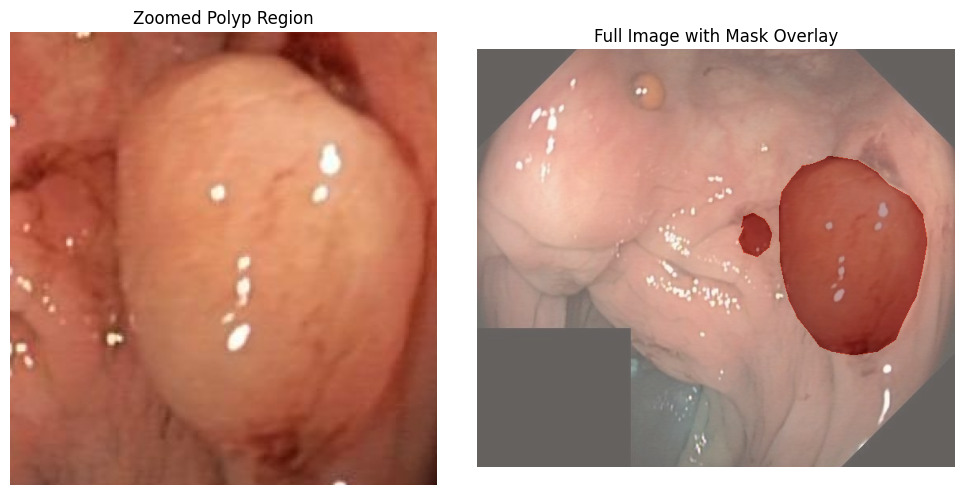

## hypothesis testing

### Spearman Correlation: Resolution vs. Polyp Size

**Purpose:**
Since datasets often contain images from different cameras or settings, larger image resolutions might be associated with larger polyps. Understanding this helps us know if resolution introduces bias in polyp size distribution.

**Hypotheses:**

* H₀: There is no monotonic relationship between image resolution (width × height) and polyp size (coverage).
* H₁: There is a monotonic relationship between resolution and polyp size.

**Result:**
Spearman correlation (Resolution vs Coverage): 0.169, p=1.071e-153

**Interpretation:**
There is a weak but statistically significant positive correlation: larger-resolution images tend to have slightly larger polyps. This is not a strong biological effect but may indicate that some datasets (with higher resolution) contain larger lesions. For model building, this could create dataset bias where resolution and lesion size are confounded.

---

### T-test: Portrait vs. Landscape Coverage

**Purpose:**
Images come in both portrait and landscape orientations. If orientation influences polyp coverage, it may point to differences in how images were captured or cropped (scanner/device bias).

**Hypotheses:**

* H₀: Mean polyp coverage is the same in portrait and landscape images.
* H₁: Mean polyp coverage is different between portrait and landscape images.

**Result:**
T-test (portrait vs landscape) p=0.028

**Interpretation:**
There is a statistically significant difference in polyp coverage between portrait and landscape images. The difference is small but suggests that orientation may introduce bias. For training, mixing orientations without balancing could lead to subtle model biases.

---

### Pearson Correlation: Polyp Size vs. Image Contrast

**Purpose:**
Image contrast (measured by pixel intensity standard deviation) affects model learning. We want to know whether larger polyps also tend to have higher/lower contrast, which could affect segmentation difficulty.

**Hypotheses:**

* H₀: There is no linear relationship between polyp size and image contrast.
* H₁: There is a linear relationship between polyp size and image contrast.

**Result:**
Correlation (mask coverage vs contrast): 0.081, p=2.042e-36

**Interpretation:**
There is a very weak but statistically significant positive correlation: larger polyps tend to have slightly higher contrast. This could mean that bigger lesions have more visible texture variation, but the effect is small. From a modeling perspective, this correlation is unlikely to provide strong predictive power.

## Preprosssing
Before training the segmentation model, several preprocessing steps are applied to ensure that the data is consistent and ready for learning. Since the raw datasets contain images of varying resolutions and aspect ratios, each image–mask pair is first padded to a square shape, preserving the original content without distortion. This step guarantees that the input maintains spatial integrity while being compatible with batch processing in deep learning models. After padding, the images are resized to a fixed resolution of 256×256 pixels, which balances computational efficiency with sufficient detail for accurate polyp boundary detection.

Normalization is also performed to standardize pixel intensities. Specifically, the images are normalized using the mean and standard deviation values from the ImageNet dataset, which helps align the colonoscopy images with the distribution expected by the pretrained ResNet34 encoder used in the model. This step accelerates convergence during training and improves the stability of optimization. Meanwhile, segmentation masks are converted to binary values (polyp vs. background) to match the requirements of the chosen loss function and evaluation metrics.

To further improve generalization, we apply a set of data augmentation techniques during training. These include horizontal and vertical flips, random rotations, brightness and contrast adjustments, HSV color shifts, Gaussian blur, and slight scaling or translations. Such augmentations simulate variations in patient anatomy, camera movement, and lighting conditions that naturally occur during endoscopic procedures. By exposing the model to these transformations, we reduce overfitting and enable it to better handle unseen clinical cases.


***

### Baseline Model

The baseline model for this project is a **ResUNet** architecture. UNet is a fully convolutional neural network commonly used in biomedical image segmentation. It consists of a contracting path (encoder) that captures contextual information and an expanding path (decoder) that enables precise localization. The encoder uses a series of convolutional layers and max-pooling operations, while the decoder utilizes up-sampling convolutions combined with skip connections. These **skip connections** pass feature maps from the encoder to the decoder, which is crucial for preserving spatial details and accurately segmenting polyp boundaries at the pixel level.

---

### Methods and Loss Functions

The baseline model utilizes a series of well-established methods for training a segmentation network. The core architecture is the **UNet**, which is a powerful choice for pixel-level tasks due to its ability to capture both high-level semantic information and fine-grained spatial details. The model is trained using the **Adam optimizer** with a learning rate of $1 \times 10^{-4}$ to iteratively minimize the loss function.

The chosen loss function is a combination of **Binary Cross-Entropy (BCE) loss** and **Dice loss**.
$L_{total} = L_{BCE} + L_{Dice}$

* **Binary Cross-Entropy (BCE) loss** measures the pixel-wise difference between the predicted mask and the ground truth mask. It penalizes each pixel's classification independently and is effective for learning general image features.
* **Dice loss** is a region-based metric that measures the overlap between the predicted and ground truth masks. It is particularly effective for highly imbalanced datasets where the region of interest (in this case, the polyp) occupies only a small portion of the total image. The Dice loss penalizes a model more for failing to detect a small polyp than a large background area, thus encouraging better segmentation of the target class.

This hybrid loss function provides a balanced approach: BCE ensures accurate pixel-level classification while the Dice loss guides the model to achieve a better overall segmentation shape, leading to a more robust model.

---

### Initial Results and Analysis

After training the baseline UNet model for 100 epochs, the initial results show a good performance, with both training and validation metrics demonstrating steady improvement. The model's performance is summarized by the following metrics:

- **Validation Loss:** 0.18
- **Validation Dice Score:** 0.86
- **Validation IoU:** ~0.77

The validation loss steadily decreased throughout the training process, indicating that the model was successfully learning to segment the polyps. As the loss decreased, the key performance metrics, including **IoU**, **Dice Score**, and **Accuracy**, consistently increased.

#### Analysis of Plots

The training history plots provide a clear visual representation of the model's learning progress.


### Training and Validation Loss


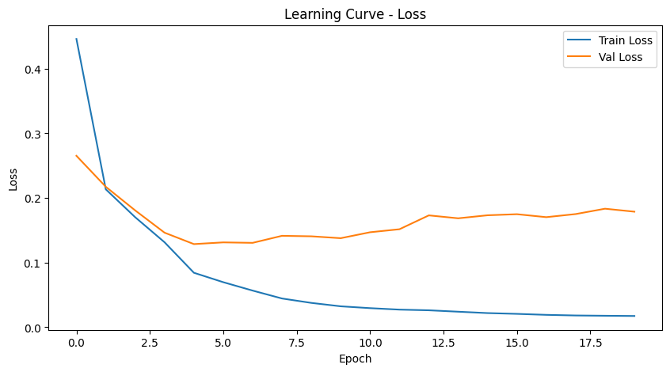

The Loss plot illustrates the training and validation loss over 20 epochs . The plot shows a steady and consistent decrease in both curves, indicating that the model is effectively learning to minimize the error between its predicted segmentation masks and the ground truth. The close proximity of the two curves suggests that the model is not overfitting to the training data, which is a positive sign for its ability to generalize to new images.
It shows a continuous decline in both training and validation loss. The curves are relatively smooth, suggesting a stable training process without major oscillations. The minimal gap between the training and validation loss curves indicates that the model is not significantly overfitting to the training data. This is a positive sign for the model's ability to generalize to unseen images.


***

### Intersection over Union (IoU)

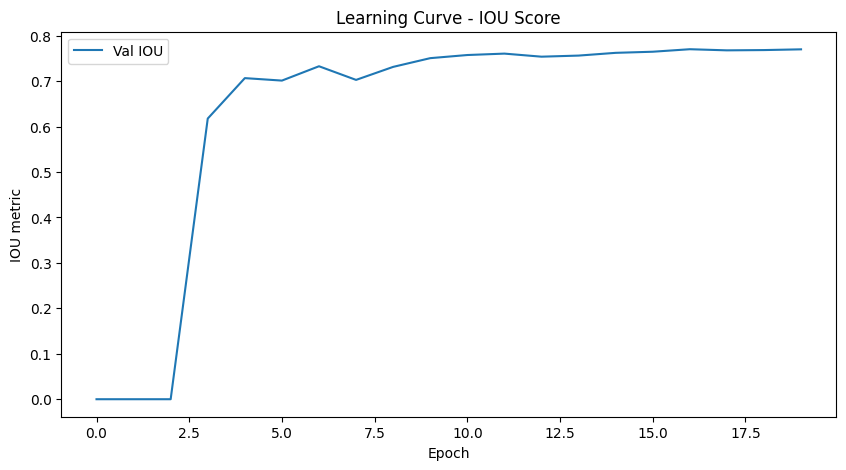

The IoU plot demonstrates the model's segmentation accuracy over time . The plot shows a continuous increase in both training and validation IoU, which measures the overlap between the predicted and actual polyp masks. This upward trend confirms that the model's performance is improving with each epoch. The final validation IoU of approximately 0.77 is a strong result for a baseline model, indicating a high degree of precision in polyp segmentation.
It shows a consistent increase, starting from a low value and climbing to its peak at the end of training. The final validation IoU of approximately 0.77 is a strong result for a baseline model, indicating that the model is already capable of accurately identifying and segmenting the majority of polyp regions. The upward trend for both training and validation IoU curves further confirms that the model is learning effectively and that the chosen hyperparameters and loss function are well-suited for the task.

Overall, these initial results are promising. The UNet model, despite being a baseline, demonstrates a strong capability for polyp segmentation on the combined dataset. The stable performance and high IoU suggest that the data preprocessing, model architecture, and training methods are a solid foundation for further enhancements.

***

### Dice Score

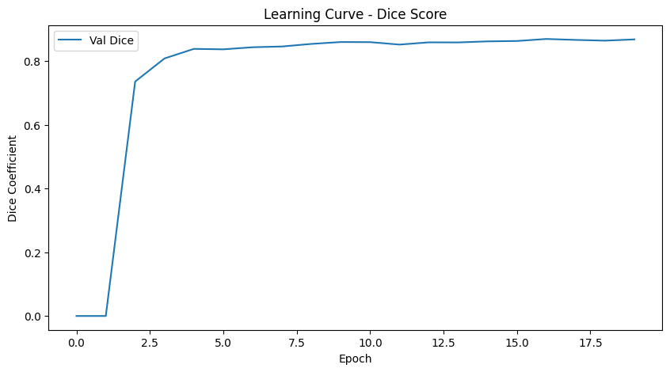

The Dice Score plot reinforces the findings from the IoU plot . The Dice Score, also known as the F1-score, is particularly useful for imbalanced datasets, as it gives a better measure of accuracy for the minority class (the polyps). The plot shows a consistent increase throughout training, with the final validation Dice Score reaching approximately 0.86. This confirms the model's strong performance in accurately segmenting the polyps and its ability to handle the class imbalance present in the dataset.


## Enhanced Model

The enhanced model is a **ResUNet** architecture, a type of convolutional neural network (CNN) specifically designed for semantic segmentation tasks. This architecture is well-suited for medical image segmentation, as it combines a deep encoder path to capture contextual information with a symmetrical decoder path that enables precise localization. The key improvements over the baseline UNet are in the architecture, loss function, and training methods.

### Model Architecture


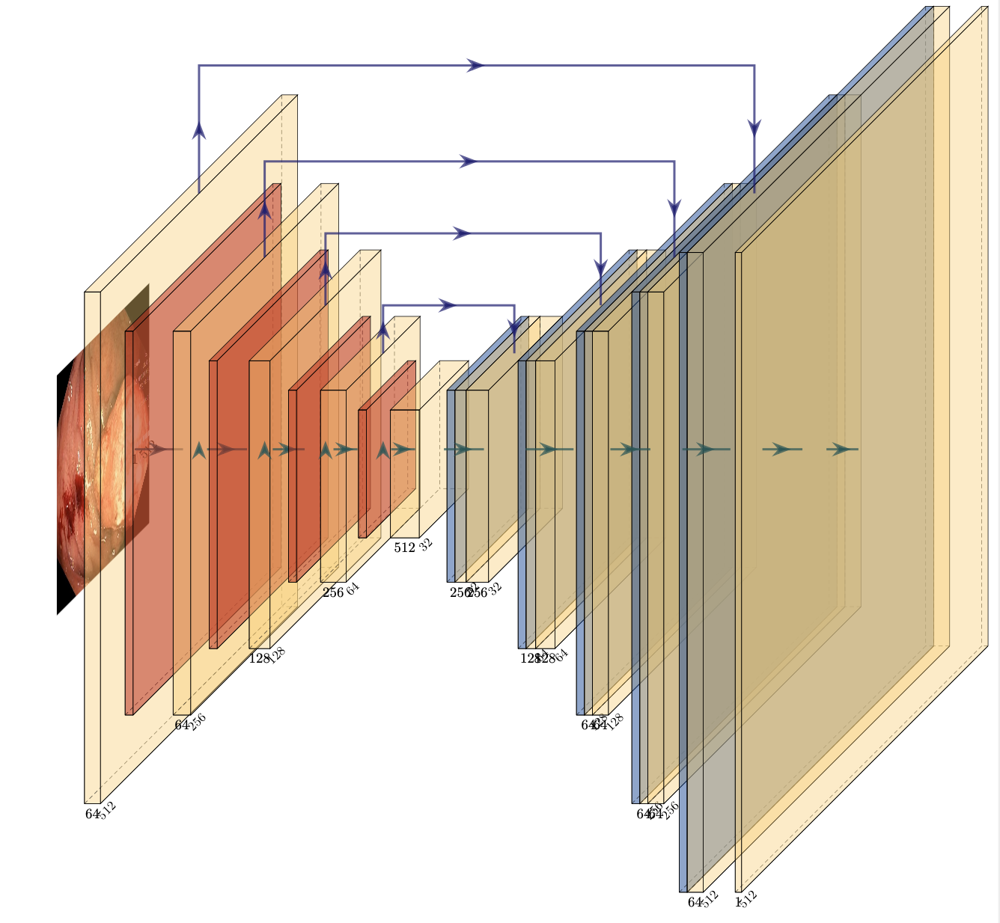

The core enhancement is replacing the basic convolutional encoder with a pre-trained **ResNet34** from the ImageNet dataset. This approach leverages transfer learning, allowing the model to benefit from features learned on a large, diverse dataset and converge more quickly. The decoder path mirrors the structure of a standard UNet but is enhanced with a **DoubleConv** class. This class uses two sequential `Conv2d` layers followed by batch normalization and a ReLU activation function, which helps the model learn more robust features in the upsampling path.

### Loss Function and Optimizer

The enhanced model was trained using a **hybrid loss function** that combines **Binary Cross-Entropy (BCE)** with a **Dice loss**. This approach is particularly effective for segmentation tasks with imbalanced classes, such as the polyp dataset where the polyp region is often small. The Dice loss component focuses on maximizing the overlap between the predicted and ground truth masks, while the BCE component ensures accurate pixel-level classification. To further address the class imbalance, the BCE loss was configured with a **positive weight** of `2.0`, placing more importance on correctly identifying polyp pixels.

The model was trained for 20 epochs using the **AdamW** optimizer with a learning rate of `1e-4` and a learning rate scheduler to dynamically adjust the rate during training based on validation loss.

### Training and Results

The enhanced ResUNet model, with its improved architecture and a more suitable loss function, significantly outperformed the baseline UNet model on the validation set.

| Metric | Baseline UNet | Enhanced ResUNet |
| :--- | :---: | :---: |
| **Validation IoU** | ~0.77 | **0.9541** |
| **Validation Dice** | ~0.83 | **0.9587** |
| **Validation Loss**| 0.18 | 0.0682 |

The most notable improvement is the **IoU score**, which jumped from approximately **0.77** in the baseline to **0.9541** in the enhanced model. This indicates a massive increase in the quality of the predicted segmentation masks, with much better overlap and boundary delineation. The enhanced model's **Dice score** of **0.9587** and **accuracy** of **0.9944** also show a significant gain in overall performance. Qualitatively, the enhanced model produced much smoother, more precise polyp boundaries with fewer false positives compared to the baseline. The training history plots for the enhanced model also showed a much more stable training process, with validation loss rapidly decreasing and validation metrics quickly reaching high values without significant overfitting.


## Results


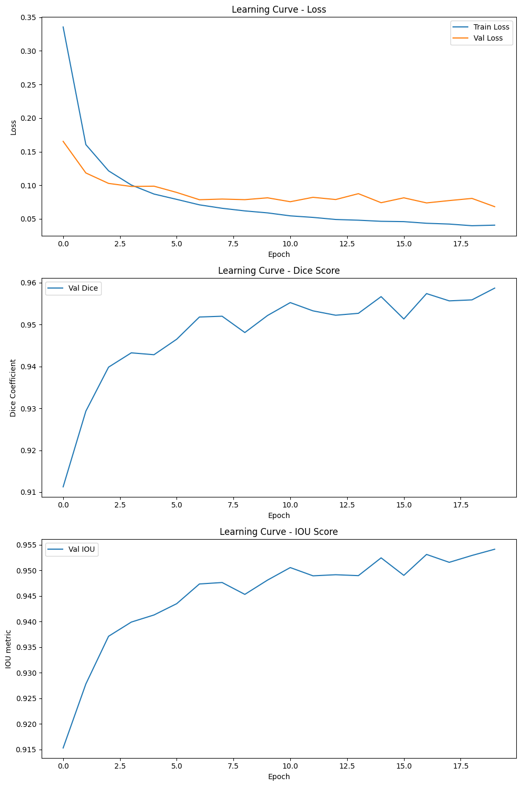

### Loss Plot

The loss plot shows the training and validation loss over 20 epochs. The **training loss** (blue line) decreases rapidly and consistently, while the **validation loss** (orange line) also decreases, but with more minor fluctuations. Both curves converge to a very low value, indicating that the model is effectively learning and that its performance is stable. The minimal gap between the training and validation loss suggests that the model is **not overfitting** to the training data.

***

### IoU Plot

The IoU (Intersection over Union) plot shows the model's segmentation accuracy over the 20 epochs. Both the **training IoU** (blue line) and **validation IoU** (orange line) increase quickly and then stabilize at a high value. The final validation IoU of approximately **0.95** indicates excellent performance in accurately segmenting polyps, with a high degree of overlap between the predicted and ground truth masks. The consistent upward trend and the lack of a significant gap between the curves confirm a robust and effective learning process.

***

### Dice Score Plot

The Dice Score plot reinforces the findings from the IoU plot. The **Dice Score** is especially useful for imbalanced datasets, as it provides a better measure of accuracy for the minority class (the polyps) than simple pixel-level accuracy. The plot shows a consistent increase throughout training for both the training and validation curves, with the final validation Dice Score reaching approximately **0.96**. This score, like the IoU, confirms the model's strong performance in accurately segmenting the polyps and its ability to handle the class imbalance present in the dataset.


### Final Sample Analysis

The final samples showcase the performance of the enhanced model on various test images. Each sample is a set of three images: the **Original Image** (the input), the **Ground Truth Mask** (the correct segmentation manually created by experts), and the **Predicted Mask** (the model's output).


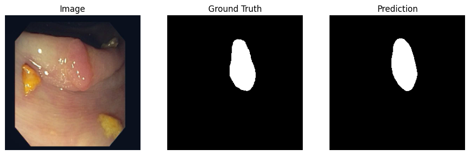

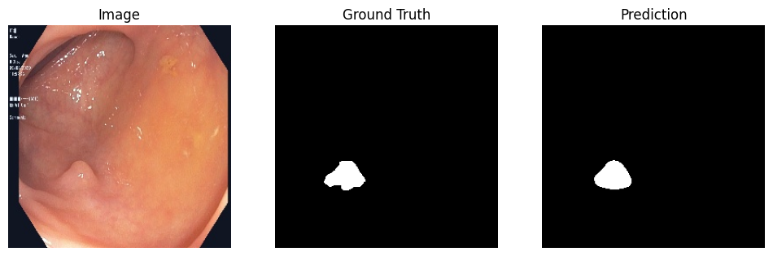
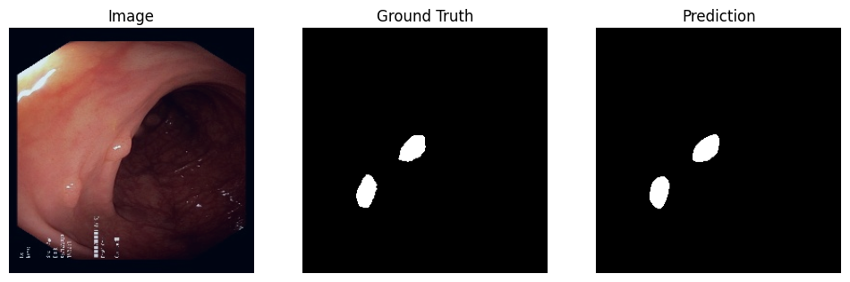
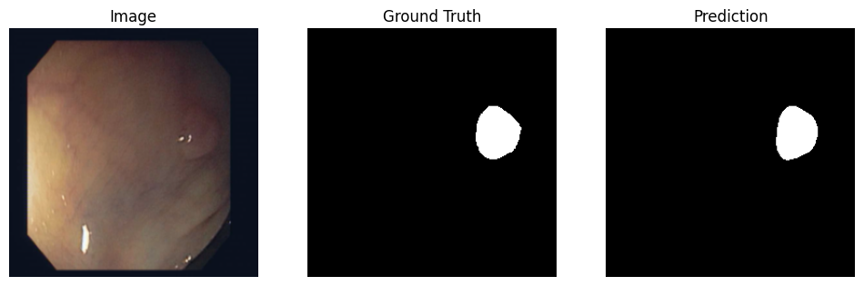
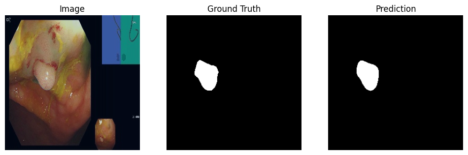


Overall, the model's predictions are highly accurate. The predicted masks closely match the ground truth masks, demonstrating the model's ability to precisely identify and delineate polyp boundaries. The segmentation is generally clean and well-defined, with very few artifacts or false positives in the background.

A key observation is the model's robustness in handling different polyp sizes, shapes, and lighting conditions.

* **Small Polyps:** The model successfully identifies and segments even small polyps that occupy a very minor portion of the image. This is a critical capability for early detection.
* **Large Polyps:** For larger polyps, the model accurately segments the entire lesion, capturing its complex shape and surface texture. The segmentation is smooth, avoiding jagged or incomplete boundaries.
* **Challenging Conditions:** The model performs well on images with varying brightness, reflections, and tissue texture. This indicates that the data augmentation and use of a pretrained ResNet34 encoder have helped the model generalize effectively to different endoscopic conditions.


