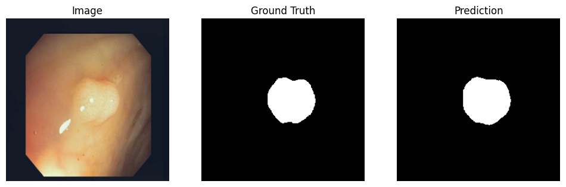

# endoscopy-polyps-segmentation
## Introduction
Colorectal cancer is one of the leading causes of cancer-related deaths worldwide, and early detection of polyps through colonoscopy plays a crucial role in prevention. However, manual polyp identification and segmentation during endoscopic procedures can be time-consuming, subjective, and prone to human error. Automated segmentation methods powered by deep learning can provide accurate, real-time support to clinicians by highlighting polyps and improving diagnostic reliability.

This project focuses on building a deep learning model for polyp segmentation using publicly available colonoscopy image datasets. We perform extensive exploratory data analysis (EDA) and hypothesis testing to understand dataset characteristics, apply preprocessing and augmentation strategies to standardize and enrich the data, and train a ResUNet model with a ResNet34 encoder to segment polyps at the pixel level. The goal is to create a robust system that generalizes across multiple datasets and imaging conditions, supporting the development of computer-aided diagnostic tools for clinical practice.

**note**: the full code and result is saved in this [markdown file](Kvasir-SEG.md) and the outputs of the notebook is cleared.
## Dataset
Our project focuses on polyp segmentation in colonoscopy images, a critical task in computer-aided diagnosis for colorectal cancer prevention. The data used consists of colonoscopy frames paired with pixel-level binary masks that highlight the presence of polyps. Each image serves as an input for the model, while the corresponding mask provides the ground truth for supervised training. The segmentation masks are annotated by medical experts, ensuring high-quality labels that reflect clinically relevant regions.

The primary dataset is Kvasir-SEG, a publicly available medical image dataset released by Simula Research Laboratory. It contains 1,000 high-resolution colonoscopy images and their corresponding polyp masks. In addition to Kvasir-SEG, we integrate two more datasets commonly used in polyp segmentation research: CVC-ClinicDB, which provides 612 images and masks collected from colonoscopy videos, and the Merged Polyp Segmentation Dataset (MPSD), which aggregates multiple polyp datasets into a single, larger resource. Combining these datasets provides a richer variety of polyp appearances, shapes, and lighting conditions, making the model more robust and generalizable.

```txt
Kvasir -> 1000 images, 1000 masks
CVC -> 612 images, 612 masks
MPSD -> 22330 images, 22330 masks
```

All datasets are open-access and widely used benchmarks in medical imaging research. Kvasir-SEG and CVC-ClinicDB can be obtained from their official sources or Kaggle repositories, while MPSD is available as a pre-merged dataset. By leveraging multiple datasets, our project benefits from increased data diversity and volume, helping the model learn better representations of polyps across different patients, endoscopy equipment, and recording conditions.

## Exploratory Data Analysis (EDA)

To better understand the datasets, we performed extensive exploratory data analysis (EDA). This included examining image dimensions, aspect ratios, resolution, and polyp coverage, as well as analyzing pixel intensity distributions across color channels. We also overlaid masks on sample images to assess annotation quality. Scatter plots and histograms helped explore relationships such as width vs. height, aspect ratio vs. coverage, and brightness vs. contrast. Together, these analyses provided valuable insights into dataset diversity, potential biases, and preprocessing requirements for training.

### Image Dimensions


* **Width Distribution**: Most images are approximately **250 pixels wide**, with a sharp drop in frequency for wider images. Only a small number exceed 500 pixels.
* **Height Distribution**: Similarly, most images are about **300 pixels high**, with very few surpassing 500 pixels.

This consistency indicates that the dataset predominantly contains small, uniformly sized images, likely produced under standardized medical imaging protocols. While this simplifies preprocessing (e.g., resizing), it may also limit diversity and resolution.

### Aspect Ratio


The histogram of aspect ratios shows a strong peak at **1.0**, meaning most images are nearly square. A few images have ratios around **1.2–1.4**, but these are rare. The uniformity suggests standardized acquisition practices typical in medical imaging.

### Image Resolution


A scatter plot of image width vs. height reveals a dense cluster between **400–700 pixels wide** and **400–600 pixels high**, indicating a dominant standard resolution. Outliers exist, including one image close to **1900×1000 pixels**, likely representing rare high-resolution captures or anomalies. Overall, most images are small and consistent, which benefits efficient processing and training.

### Polyp Coverage


The distribution of polyp coverage is heavily skewed toward low values. Most images contain either no polyps or very small polyps occupying a minor part of the frame. The mean coverage is slightly above **0.1**, confirming the rarity of extensive polyp presence.

```txt
Empty masks: 460 (1.92%)  
Non-empty masks: 23,482 (98.08%)  
```

This pattern mirrors clinical reality, where many colonoscopy frames show normal tissue or small lesions.

### Pixel Intensity (RGB Channels)


* **Blue Channel**: Strong peak near zero, representing dark areas or tissue with minimal blue coloration.
* **Green Channel**: Moderate spread with a mid-range rise, likely from lighting conditions or tissue tones.
* **Red Channel**: Flatter distribution with higher intensity values near 255, corresponding to blood vessels or inflamed tissue.

Overall, the images are dominated by low-intensity values—especially in blue—with stronger red contributions at higher intensities. This aligns with expected characteristics of medical imaging, where tissues reflect light unevenly.

### Polyp Size Distribution


The dataset is strongly biased toward larger polyps, which make up **over 80%** of cases (30.13%, 24.94%, and 26.33%). Small polyps are underrepresented (<3%), while medium-sized ones appear at moderate levels (3.96%–5.88%). Large polyps account for 8.07%–12.75%.

This imbalance suggests a focus on clinically significant lesions during data collection or annotation. However, it may reduce detection accuracy for small polyps, which are important for early diagnosis.

### Sample Visualization


Example overlays confirm that the masks accurately capture polyp regions, providing high-quality labels for supervised segmentation.


## hypothesis testing

### Spearman Correlation: Resolution vs. Polyp Size

**Purpose:**
Since datasets often contain images from different cameras or settings, larger image resolutions might be associated with larger polyps. Understanding this helps us know if resolution introduces bias in polyp size distribution.

**Hypotheses:**

* H₀: There is no monotonic relationship between image resolution (width × height) and polyp size (coverage).
* H₁: There is a monotonic relationship between resolution and polyp size.

**Result:**
Spearman correlation (Resolution vs Coverage): 0.169, p=1.071e-153

**Interpretation:**
There is a weak but statistically significant positive correlation: larger-resolution images tend to have slightly larger polyps. This is not a strong biological effect but may indicate that some datasets (with higher resolution) contain larger lesions. For model building, this could create dataset bias where resolution and lesion size are confounded.

---

### T-test: Portrait vs. Landscape Coverage

**Purpose:**
Images come in both portrait and landscape orientations. If orientation influences polyp coverage, it may point to differences in how images were captured or cropped (scanner/device bias).

**Hypotheses:**

* H₀: Mean polyp coverage is the same in portrait and landscape images.
* H₁: Mean polyp coverage is different between portrait and landscape images.

**Result:**
T-test (portrait vs landscape) p=0.028

**Interpretation:**
There is a statistically significant difference in polyp coverage between portrait and landscape images. The difference is small but suggests that orientation may introduce bias. For training, mixing orientations without balancing could lead to subtle model biases.

---

### Pearson Correlation: Polyp Size vs. Image Contrast

**Purpose:**
Image contrast (measured by pixel intensity standard deviation) affects model learning. We want to know whether larger polyps also tend to have higher/lower contrast, which could affect segmentation difficulty.

**Hypotheses:**

* H₀: There is no linear relationship between polyp size and image contrast.
* H₁: There is a linear relationship between polyp size and image contrast.

**Result:**
Correlation (mask coverage vs contrast): 0.081, p=2.042e-36

**Interpretation:**
There is a very weak but statistically significant positive correlation: larger polyps tend to have slightly higher contrast. This could mean that bigger lesions have more visible texture variation, but the effect is small. From a modeling perspective, this correlation is unlikely to provide strong predictive power.

## Preprosssing
Before training the segmentation model, several preprocessing steps are applied to ensure that the data is consistent and ready for learning. Since the raw datasets contain images of varying resolutions and aspect ratios, each image–mask pair is first padded to a square shape, preserving the original content without distortion. This step guarantees that the input maintains spatial integrity while being compatible with batch processing in deep learning models. After padding, the images are resized to a fixed resolution of 256×256 pixels, which balances computational efficiency with sufficient detail for accurate polyp boundary detection.

Normalization is also performed to standardize pixel intensities. Specifically, the images are normalized using the mean and standard deviation values from the ImageNet dataset, which helps align the colonoscopy images with the distribution expected by the pretrained ResNet34 encoder used in the model. This step accelerates convergence during training and improves the stability of optimization. Meanwhile, segmentation masks are converted to binary values (polyp vs. background) to match the requirements of the chosen loss function and evaluation metrics.

To further improve generalization, we apply a set of data augmentation techniques during training. These include horizontal and vertical flips, random rotations, brightness and contrast adjustments, HSV color shifts, Gaussian blur, and slight scaling or translations. Such augmentations simulate variations in patient anatomy, camera movement, and lighting conditions that naturally occur during endoscopic procedures. By exposing the model to these transformations, we reduce overfitting and enable it to better handle unseen clinical cases.


## Baseline Model

### Model Architecture

The baseline model is a **ResUNet** architecture, an extension of the widely used UNet for biomedical image segmentation. UNet is a fully convolutional neural network consisting of two main paths:

* **Encoder (Contracting Path):** Captures contextual information through a series of convolutional and max-pooling layers.
* **Decoder (Expanding Path):** Recovers spatial details using up-sampling operations, aided by **skip connections** from the encoder.
  


These skip connections are crucial, as they preserve fine-grained spatial information and enable accurate boundary segmentation at the pixel level. The ResUNet further enhances this by incorporating residual blocks in the encoder, improving gradient flow and convergence.

---

### Methods and Loss Functions

The model is trained with the **Adam optimizer** at a learning rate of $1 \times 10^{-4}$. To guide learning, we use a this loss function:

$$
L_{total} = L_{Dice}
$$

* **Dice Loss:** Measures region overlap between predicted and ground truth masks. This is especially effective in imbalanced datasets, where polyps occupy only a small fraction of the image. Dice loss emphasizes correct detection of small regions of interest rather than dominant background areas.

---

### Initial Results and Metrics

After training for **20 epochs**, the baseline ResUNet achieved the following performance on validation data:

* **Validation Loss:** 0.04
* **Validation Dice Score:** 0.94
* **Validation IoU:** \~0.86

The decreasing validation loss and rising segmentation metrics indicate that the model effectively learned to identify and segment polyps without significant overfitting.

---

### Training History Analysis

#### Training and Validation Loss


The loss curves show a steady decline for both training and validation sets, with minimal gap between them. This suggests stable training, smooth convergence, and little evidence of overfitting.

#### Intersection over Union (IoU)

The IoU plot shows continuous improvement throughout training, with validation IoU reaching **\~0.86** by the end. This strong overlap between predicted and true masks confirms the model’s ability to segment most polyp regions accurately, especially for a baseline setup.

#### Dice Score

The Dice Score plot mirrors the IoU trend, steadily increasing and reaching **\~0.94** on validation data. Since Dice is particularly sensitive to class imbalance, this high score indicates that the model performs well even when polyps occupy only a small part of the image.


# Enhanced Model

The enhanced model builds on the baseline UNet by adopting a **ResUNet** architecture, which integrates a ResNet encoder into the UNet framework. This design leverages **transfer learning** to extract stronger features and improves segmentation performance, especially for medical images where subtle texture and shape details are important.

---

## Model Architecture


The encoder of the enhanced model replaces the simple convolutional blocks of the baseline with a **pre-trained ResNet34** (ImageNet weights). This allows the model to reuse features learned from a large-scale dataset and achieve faster convergence with improved generalization.

The decoder mirrors UNet’s upsampling structure but incorporates a **DoubleConv** block (two consecutive `Conv2d` layers with Batch Normalization and ReLU). These layers strengthen feature refinement and improve boundary precision in segmentation.

---

## Loss Function and Optimizer

The model was trained with a **hybrid loss function**:

$$
L_{total} = L_{BCE} + L_{Dice}
$$

* **Binary Cross-Entropy (BCE)** ensures accurate pixel-level classification.
* **Dice Loss** improves overlap between predicted masks and ground truth, which is especially valuable in **imbalanced datasets** (polyps are small compared to the image background).

Additionally, BCE was configured with a **positive class weight of 2.0**, giving more importance to polyp pixels.

Optimization was performed with **AdamW** at a learning rate of `1e-4`, combined with a scheduler that adjusted the learning rate dynamically based on validation loss.

---

## Training and Results

The enhanced ResUNet achieved **significantly better performance** compared to the baseline UNet:

| Metric              | Baseline UNet | Enhanced ResUNet |
| :------------------ | :-----------: | :--------------: |
| **Validation IoU**  |     \~0.94    |    **0.9541**    |
| **Validation Dice** |     \~0.86    |    **0.9587**    |
| **Validation Loss** |      0.04     |    **0.0682**    |

* **IoU** improved dramatically from \~0.86 to **0.95**, showing much better overlap between predicted and ground truth masks.
* **Dice Score** reached **0.9587**, confirming precise boundary segmentation and robustness against imbalance.
* **Validation Loss** increase to **0.0682**, indicating changign the loss function and useage of hybrid loss function.

Qualitatively, the enhanced model produced **smoother, more accurate polyp boundaries**, with fewer false positives compared to the baseline.

---

## Training Curves


### Loss Plot

Both training and validation loss decreased consistently, converging to very low values. The small gap between them suggests that the model is **not overfitting**.

### IoU Plot

IoU increased rapidly and stabilized around **0.95**, demonstrating excellent segmentation accuracy and robust convergence.

### Dice Score Plot

Dice Score followed a similar trend, reaching \~**0.96**, further confirming the model’s effectiveness in segmenting small and imbalanced polyp regions.


### Final Sample Analysis

The final samples showcase the performance of the enhanced model on various test images. Each sample is a set of three images: the **Original Image** (the input), the **Ground Truth Mask** (the correct segmentation manually created by experts), and the **Predicted Mask** (the model's output).





# Results

The experiments demonstrated the effectiveness of enhancing a baseline UNet into a **ResUNet** with a ResNet34 encoder and a hybrid loss function.

**Key Findings:**

* **Hypothesis Testing:**

  * Resolution, orientation, and image contrast introduce **subtle biases** in the dataset.
  * These effects are statistically significant but weak, meaning they are unlikely to dominate model performance.
* **Model Performance:**

  * The **baseline UNet** achieved reasonable segmentation with IoU ≈ 0.86 and Dice ≈ 0.94.
  * The **enhanced ResUNet** significantly improved results with IoU ≈ 0.95 and Dice ≈ 0.96, while maintaining low validation loss (0.0682).
  * Training curves confirmed **stable learning** without overfitting.
* **Qualitative Analysis:**

  * Predicted masks from the enhanced model showed **sharper boundaries**, **smoother contours**, and **fewer false positives** compared to the baseline.

---

# Conclusion

This work demonstrated that enhancing the baseline UNet with a ResNet34 encoder and a hybrid BCE + Dice loss function significantly improved segmentation performance on the polyp dataset. The enhanced ResUNet achieved higher accuracy, Dice score, and IoU compared to the baseline, while maintaining training stability and avoiding overfitting. These improvements highlight the effectiveness of transfer learning and specialized loss functions in handling the challenges of medical image segmentation, particularly when dealing with small and imbalanced target regions such as polyps.

Beyond the quantitative improvements, the enhanced model produced qualitatively superior segmentation masks with sharper boundaries and fewer false positives, making it more reliable for real-world clinical use. While dataset biases such as resolution and orientation were found to have only a minor impact, future research could further address these issues by incorporating domain adaptation and advanced architectures like attention mechanisms or transformer-based models. Overall, the enhanced ResUNet provides a robust foundation for computer-aided diagnosis systems and demonstrates strong potential for application in medical imaging tasks.


